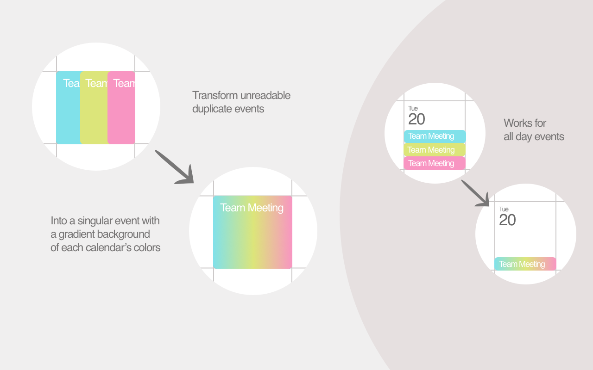

#Gradient Google Multi-Calendar Event Merge

Chrome extension that visually merges the same event on multiple Google Calendars into one event.

## Download [for Chrome]

<!--  -->

## Classic UI

For reference, [here's the last commit before changing to support the newer UI.](https://github.com/imightbeamy/gcal-multical-event-merge/blob/bed9a531157e14bf86463ea7970f8ce0ef76db1d/events.user.js)

Modified from @imightbeAmy
